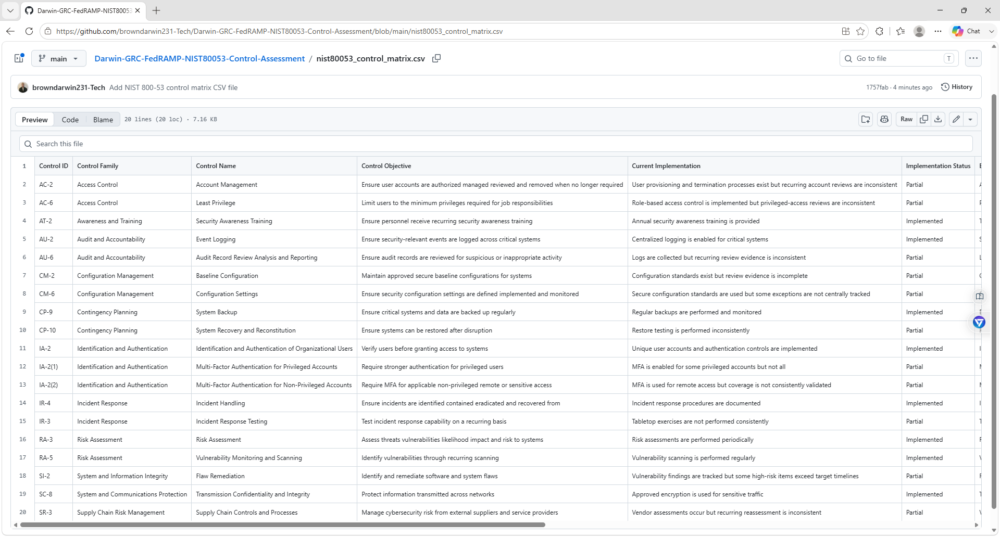
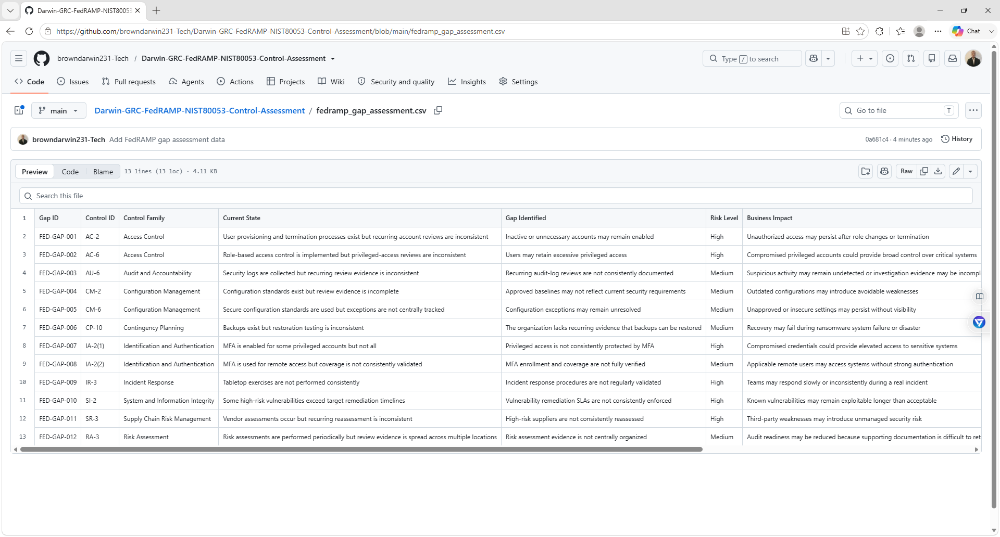
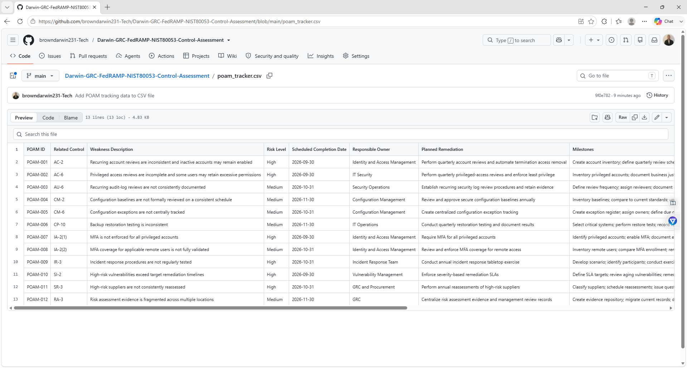
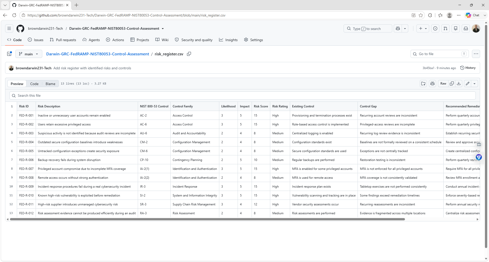

# Darwin-GRC-FedRAMP-NIST80053-Control-Assessment

## Project Overview

This project simulates a FedRAMP-aligned cloud security control assessment using NIST SP 800-53 concepts for a fictional cloud service provider called **CloudNova Federal Cloud**.

The goal is to evaluate security controls, identify implementation gaps, assess risk, track remediation through a POA&M, and document evidence that would support a cloud compliance review.

This project demonstrates practical GRC skills including:

- FedRAMP
- NIST SP 800-53
- Security control assessment
- Control implementation review
- Evidence evaluation
- Gap analysis
- Risk assessment
- POA&M tracking
- Remediation planning
- Audit readiness
- Compliance documentation

## Business Scenario

CloudNova Federal Cloud is a fictional SaaS provider preparing its cloud environment for federal security compliance expectations.

The environment uses:

- Microsoft Azure
- Microsoft 365
- Multi-Factor Authentication
- Role-based access control
- Centralized logging
- Vulnerability scanning
- Endpoint protection
- Incident response procedures
- Backup and recovery systems
- Third-party service providers

The organization wants to evaluate selected NIST SP 800-53 controls and determine whether control implementation and supporting evidence are sufficient.

## Assessment Scope

The assessment focuses on selected control families including:

- Access Control
- Awareness and Training
- Audit and Accountability
- Configuration Management
- Contingency Planning
- Identification and Authentication
- Incident Response
- Risk Assessment
- System and Communications Protection
- System and Information Integrity
- Supply Chain Risk Management

## Assessment Method

Each control is evaluated using:

1. Control ID
2. Control Family
3. Control Objective
4. Current Implementation
5. Implementation Status
6. Evidence Expected
7. Evidence Status
8. Risk Level
9. Gap Identified
10. Recommended Remediation

## Implementation Status Ratings

- Implemented
- Partial
- Missing
- Not Tested

## Evidence Status Ratings

- Accepted
- Partial
- Missing
- Exception

## Key Findings

| Control Area | Status | Risk |
|---|---|---|
| Account Management | Partial | High |
| Least Privilege | Partial | High |
| Security Awareness Training | Implemented | Low |
| Audit Logging | Implemented | Low |
| Log Review | Partial | Medium |
| Configuration Baselines | Partial | Medium |
| Backup Restoration Testing | Partial | Medium |
| Multi-Factor Authentication | Partial | High |
| Incident Response Testing | Partial | High |
| Vulnerability Remediation | Partial | High |
| Third-Party Risk Review | Partial | High |

## Risk Assessment Method

Risk is calculated using:

Risk Score = Likelihood × Impact

### Risk Ratings

- 1–4 = Low
- 5–10 = Medium
- 11–15 = High
- 16–25 = Critical

## Example Risks

| Risk | Likelihood | Impact | Score | Rating |
|---|---:|---:|---:|---|
| Excessive privileged access | 3 | 5 | 15 | High |
| Incomplete MFA coverage | 3 | 5 | 15 | High |
| Unpatched critical vulnerability | 3 | 5 | 15 | High |
| Incident response failure | 3 | 5 | 15 | High |
| Incomplete log review | 2 | 4 | 8 | Medium |
| Backup restoration failure | 2 | 5 | 10 | Medium |
| Third-party compromise | 3 | 4 | 12 | High |

## Example Control Finding

### AC-6 Least Privilege

**Current State:**  
Role-based access controls are implemented, but privileged-access reviews are inconsistent.

**Implementation Status:**  
Partial

**Risk Level:**  
High

**Gap:**  
Some users may retain elevated permissions that are no longer required.

**Recommendation:**  
Perform quarterly privileged-access reviews, document business justification, remove unnecessary permissions, and retain approval evidence.

## FedRAMP POA&M Tracking

The project includes a simulated Plan of Action and Milestones (POA&M) used to track identified weaknesses.

Each item includes:

- Weakness ID
- Related control
- Risk level
- Corrective action
- Responsible owner
- Target completion date
- Current status
- Validation evidence
- Closure criteria

## Evidence Examples

Supporting evidence may include:

- Access review reports
- MFA configuration
- Security training records
- SIEM screenshots
- Vulnerability scan reports
- Patch tickets
- Incident response plans
- Tabletop exercise reports
- Backup restoration reports
- Configuration baselines
- Vendor security assessments
- POA&M records

## Remediation Priorities

1. Enforce MFA for all privileged and remote access
2. Improve privileged-access reviews
3. Remediate critical vulnerabilities within defined timelines
4. Test incident response procedures annually
5. Improve log review documentation
6. Formalize configuration baseline reviews
7. Perform recurring backup restoration testing
8. Strengthen third-party security review
9. Track all open weaknesses through the POA&M

## Repository Structure

Darwin-GRC-FedRAMP-NIST80053-Control-Assessment/
│
├── README.md
├── nist80053_control_matrix.csv
├── fedramp_gap_assessment.csv
├── poam_tracker.csv
├── risk_register.csv
├── control_findings.md
├── remediation_plan.md
└── evidence/

## Evidence Screenshots

### NIST SP 800-53 Control Matrix

### FedRAMP Gap Assessment

### POA&M Tracker

### FedRAMP Risk Register

## Skills Demonstrated

- FedRAMP
- NIST SP 800-53
- Governance, Risk, and Compliance
- Security Control Assessment
- Control Testing
- Evidence Review
- Gap Analysis
- Risk Assessment
- POA&M Management
- Access Control
- Vulnerability Management
- Incident Response
- Audit Logging
- Third-Party Risk
- Remediation Planning
- Compliance Documentation

## Project Goal

The goal of this project is to demonstrate practical federal cloud GRC skills by reviewing NIST SP 800-53 controls, evaluating evidence, identifying control weaknesses, assessing risk, tracking remediation through a POA&M, and documenting audit-ready findings.
